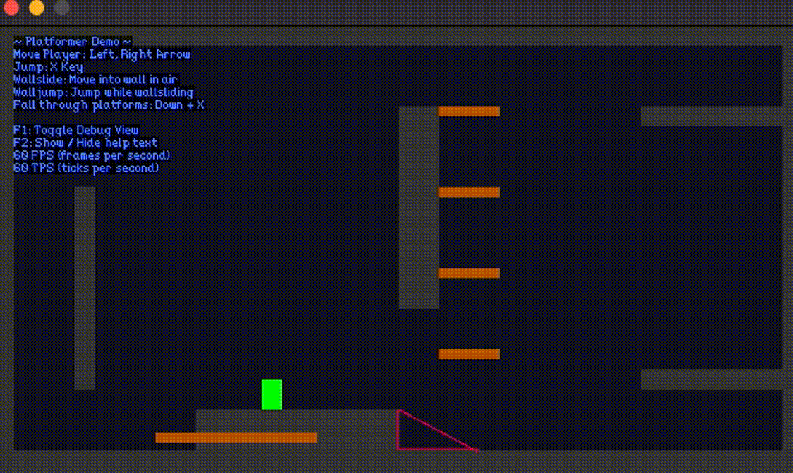

# Platformer
This project is based on the example project `examples/platformer` from [donburi](https://github.com/yohamta/donburi).

## Changes

- Improved player movement
    - Improved jump responsiveness by adding jump buffers. Mistimed jumps before landing are still registered. 
    - Added coyote time. For a short amount of time after running off a platform, the player will be able to register a jump if they mistimed it.
    - Added ability to control jump height by releasing the jump button early.

- Added cameras
    - Added a camera trap that offsets the camera position slightly towards the direction the player is facing at.
    - Added Zooming in/out.
    - Implemented camera behavior that follows the player and is bounded by the game world's size.

- Added sprites and animations
    - Added ability to define animation sheets from a given texture.

- Refactor deprecated code